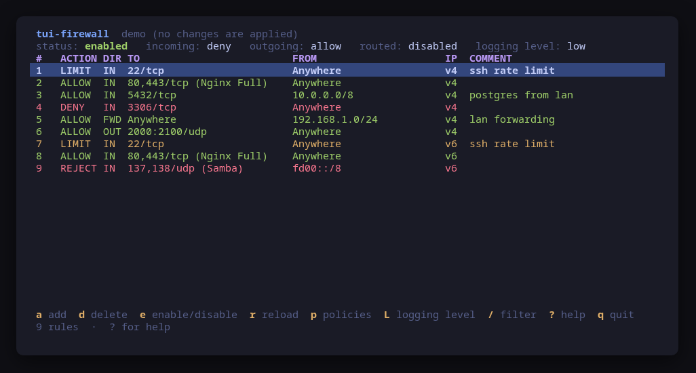
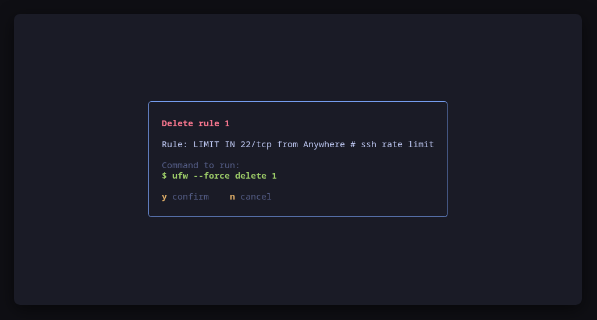
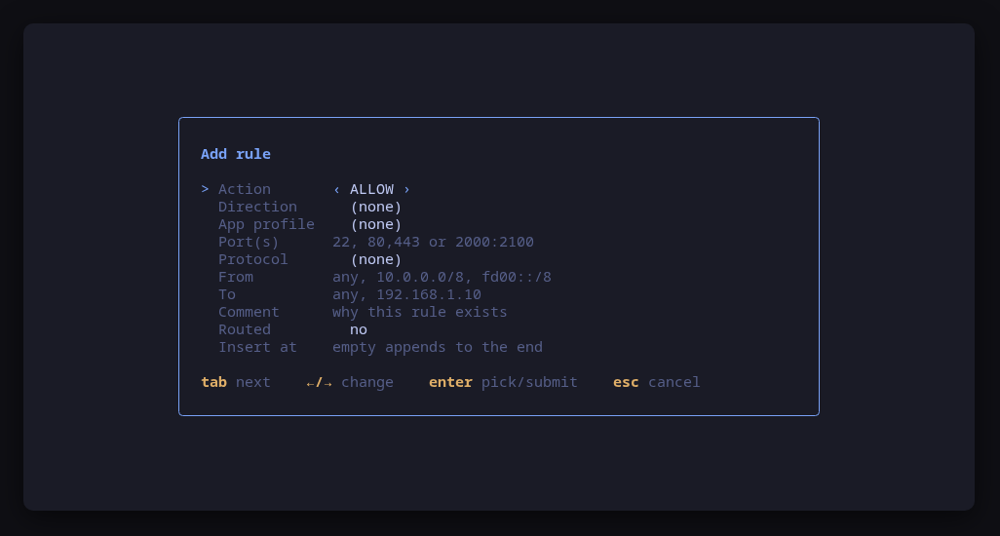
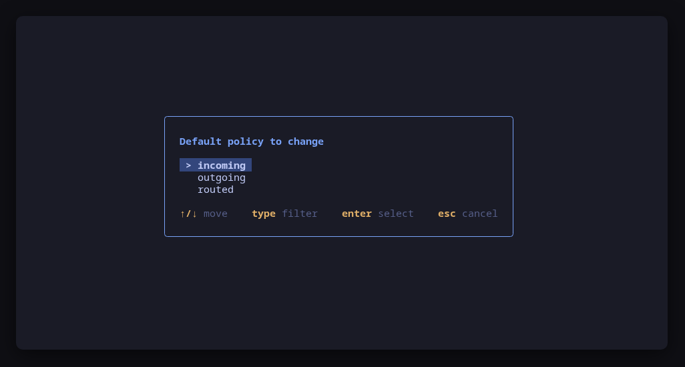
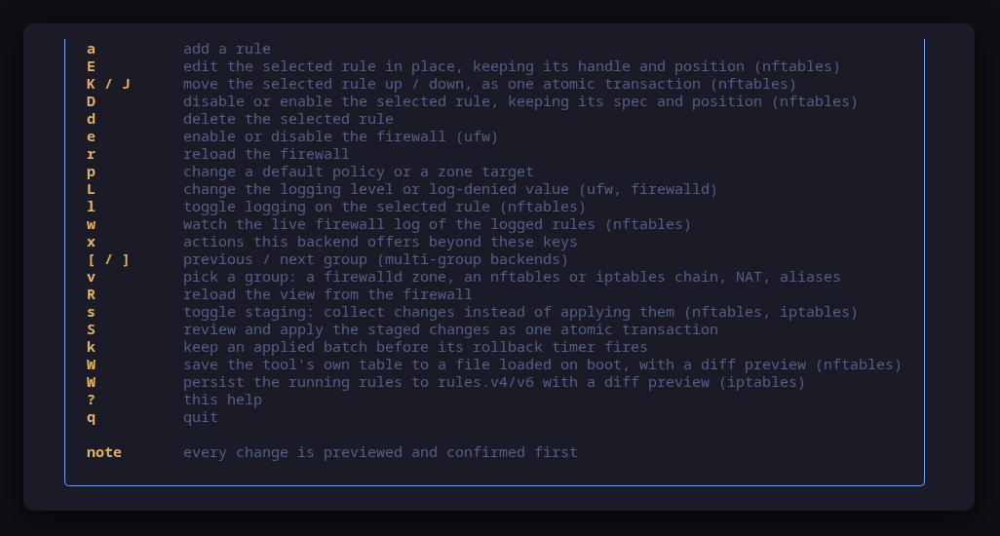
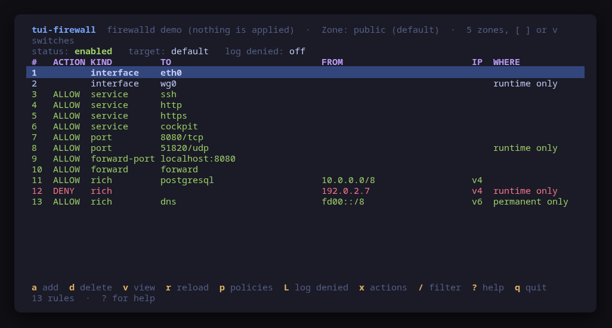
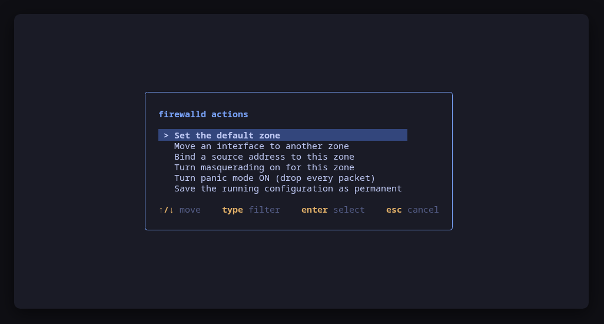

A terminal UI for the Linux firewall — **ufw** and **firewalld** — that shows
the rules you actually have and **previews the exact command line of every
change before running it**.

Neither firewall has a TUI: you get the CLI, or a desktop GUI. `tui-firewall`
fills the gap on a server or a tiling desktop, in the
[Omarchy](https://omarchy.org) visual style. It picks the backend your machine
actually runs, and the screen is built from what that backend can do — one rule
list and three default policies for ufw, one group per zone with its target for
firewalld.



> **Status: early, under validation.** An independent tool that follows the
> Omarchy visual style; it is **not** part of the Omarchy project and not
> endorsed by its maintainers. Expect rough edges.

## Install

<!-- install:start -->
<!-- Generated by tui-kit/tools/render-install.py from tool.json. -->
<!-- Edit the manifest, then run `make readme`. -->

### Any distribution, static binary

```sh
curl -fsSL https://github.com/tui-tools/tui-firewall/releases/download/v0.1.0/tui-firewall_0.1.0_linux_amd64.tar.gz | tar -xz tui-firewall
sudo install -m0755 tui-firewall /usr/local/bin/tui-firewall
```

One static binary. Verify it against checksums.txt from the same release.

### From source

```sh
git clone https://github.com/tui-tools/tui-firewall
cd tui-firewall && make build
sudo install -m0755 bin/tui-firewall /usr/local/bin/tui-firewall
```

Needs Go 1.26 or newer.

The distribution packages are not published yet. The commands below are here so
you know what they will be; a package repository at `pkgs.tui.tools` is what
turns them on.

### Arch Linux — coming soon

Needs the tui-tools repository, which is a [one-time
setup](https://tui-tools.github.io/install/).

```sh
sudo pacman -S tui-firewall
```

Add the tui-tools repository to pacman.conf first.

### Arch Linux (AUR) — coming soon

```sh
paru -S tui-firewall-bin
```

The -bin package installs the released static binary.

### Debian and Ubuntu — coming soon

Needs the tui-tools repository, which is a [one-time
setup](https://tui-tools.github.io/install/).

```sh
sudo apt install tui-firewall
```

Add the tui-tools apt repository and its keyring first.

### Fedora and RHEL — coming soon

Needs the tui-tools repository, which is a [one-time
setup](https://tui-tools.github.io/install/).

```sh
sudo dnf install tui-firewall
```

Add the tui-tools.repo file first.

### openSUSE — coming soon

Needs the tui-tools repository, which is a [one-time
setup](https://tui-tools.github.io/install/).

```sh
sudo zypper install tui-firewall
```

Add the tui-tools repository first.

### Verify a download

Every release of `tui-firewall` ships a `checksums.txt`. Check an archive
against it before installing:

```sh
sha256sum -c checksums.txt --ignore-missing
```
<!-- install:end -->

One static binary, no daemon, no state of its own. Nothing keeps running after
you quit.

## Try it without root

```sh
tui-firewall --demo             # an in-memory ufw
tui-firewall --demo=firewalld   # an in-memory firewalld
```

`--demo` runs against an in-memory sample firewall. Every key works, every
command is built and previewed for real, and nothing touches your system. The
two demos are the two real backends over fake output, not two skins: the
firewalld one parses firewalld-shaped text with the same parser and builds its
commands with the same builder.

## Every change is previewed



`y` runs the command shown, `n` does not. There is no other path to a change:
the UI hands the same value to the preview and to the runner, so what you read
is what executes.

## Usage

```sh
tui-firewall                      # drive the real firewall
tui-firewall --demo               # sample ufw data, no privileges needed
tui-firewall --demo=firewalld     # sample firewalld data
tui-firewall --check              # read the firewall, print JSON, exit
tui-firewall --backend ufw        # skip autodetection
tui-firewall --backend firewalld
tui-firewall --theme ~/mytheme/colors.toml
tui-firewall --sudo ""            # run the firewall command directly (as root)
tui-firewall --version
```

### `--check`, for scripts and tests

`--check` is the non-interactive read path: it loads the firewall through the
same backend the UI would use, prints the parsed model as JSON and exits 0, or
exits 1 with the reason if the backend cannot be read. No UI, and it never
builds or runs a mutation, so it is safe to run anywhere.

```console
$ sudo -n tui-firewall --check | head -8
{
  "tool": "tui-firewall",
  "version": "0.1.0",
  "backend": "ufw",
  "describe": "ufw via /usr/bin/sudo -n",
  "enabled": true,
  "logging": "low",
  "groups": 1,
```

It exists so a test can assert on what the tool *parsed* rather than on what it
painted — for instance that the rule count matches `ufw status numbered`, or
that a port added to the runtime configuration alone is reported as
`"Note": "runtime only"`, which is what catches a parser regression.

The report also carries a `backends` block naming every backend this tool
knows and what the detector saw of it, so "firewalld was chosen" is
distinguishable from "ufw is not installed" without running the detection
again. The version is probed for the selected backend only: probing the other
would run a binary nobody asked this tool to touch.

[tui-lab](https://github.com/tui-tools/tui-lab) uses it to test this tool
against real firewalls on Ubuntu, Fedora and Omarchy Server; the assertions live
in [`test/smoke.sh`](test/smoke.sh).

`tui-firewall` needs root to change anything, and to read anything on ufw. When
it is not running as root it uses `sudo -n`, which never prompts: run `sudo -v`
in another terminal first, or start `tui-firewall` with sudo. If neither
firewall nor `sudo` is available, it says so and points at `--demo`.

## Keys

| Key | Action |
| --- | --- |
| `↑`/`k`, `↓`/`j` | Move the selection |
| `g` / `G` | First / last rule |
| `pgup` / `pgdn` | Scroll a page |
| `/` | Filter rules (matches any column; `esc` clears) |
| `a` | Add a rule |
| `d` | Delete the selected rule |
| `e` | Enable or disable the firewall (ufw only) |
| `r` | Reload the firewall |
| `p` | Change a default policy (ufw) or a zone target (firewalld) |
| `L` | Change the logging level (ufw) or the log-denied value (firewalld) |
| `x` | Actions this backend offers beyond these keys |
| `[` / `]` | Previous / next group — the firewalld zones and policy objects |
| `R` | Re-read the firewall |
| `?` | Help |
| `q` | Quit |

In the **add rule** form: `tab` / `shift+tab` move between fields, `←`/`→`
cycle a choice, `enter` opens a picker on a choice field and submits from a
text field, `esc` cancels.







## firewalld



A firewalld zone holds several species of entry at once, so each row carries
its **kind** — service, port, protocol, source port, forward port, bound
source, assigned interface, masquerading, intra-zone forwarding, ICMP block,
rich rule. The kind is what decides which flag removes it, which is why it is
shown rather than flattened away.

### Runtime and permanent, side by side

firewalld keeps two configurations: the one enforced right now and the one that
survives a reload or a reboot. They routinely differ — an interface
NetworkManager assigned, a port someone added without `--permanent`, a change
made permanently and not yet reloaded. `tui-firewall` reads both
(`--list-all-zones` and the same with `--permanent`) and marks the difference in
a **WHERE** column: nothing when an entry is in both, `runtime only` or
`permanent only` when it is not.

That also decides what a delete does. Removing an entry that exists in both
issues both commands; removing one that exists in the runtime only issues the
runtime command alone, because the permanent form would simply fail.

### How a change is applied

Every change runs **twice**: the command as it is, then the same command with
`--permanent`. Both lines are in the confirm dialog, and nothing else runs.

```console
firewall-cmd --zone=public --add-service=wireguard
firewall-cmd --permanent --zone=public --add-service=wireguard
```

The alternative — `--permanent` followed by `--reload` — was rejected on
purpose: a reload rebuilds the rule set and can drop established connections,
which is a bad thing to do to someone who just wanted to open a port over SSH.

There is exactly one change firewalld has no runtime form for, the **zone
target**: `--set-target` is permanent-only, so that change is written
permanently and applied with a reload. The dialog says so before you confirm.

### Actions beyond the shared keys



`x` opens the actions a backend offers that the common key map has no place
for. For firewalld those are: set the default zone, move an interface to
another zone, bind a source address to this zone, turn masquerading on or off,
turn **panic mode** on or off, and save the running configuration as permanent
(`--runtime-to-permanent`). Each one previews its commands like any other
change, and panic mode says in as many words that it drops the SSH session you
are reading it in.

The UI does not know what any of these mean: the backend describes them, the UI
collects the answers and previews whatever comes back. That is the same reason
`e` is absent on firewalld — starting and stopping a system service is
`systemctl`'s job, and the tool says so instead of doing it quietly.

## What v0.1 can do

**Both backends**

- Read the live firewall and show status, default policies and logging.
- List rules with action, source, destination, ports, protocol, service,
  address family and comment; filter across every column.
- Add and delete rules, reload, change a default policy, change the logging
  level — each previewed and confirmed first.
- Follow the active Omarchy theme, and respect `NO_COLOR`.

**ufw**

- Read `ufw status verbose`, `ufw status numbered` and `ufw app list`.
- Default policies for incoming, outgoing and routed traffic; `route` rules and
  IPv6 rules included.
- Add a rule with an action (allow/deny/reject/limit), a direction, a port,
  port list or range, a protocol, an app profile, source and destination CIDR,
  a comment, and insertion at a given position.
- Enable and disable the firewall.

**firewalld**

- Read `--state`, `--get-default-zone`, `--get-active-zones`,
  `--list-all-zones` (runtime and permanent), `--get-services`,
  `--get-log-denied`, `--query-panic`, `--query-lockdown` and the policy
  objects from `--get-policies`.
- One group per zone, default zone first, then the other active zones; policy
  objects follow as further groups.
- Every entry kind, each marked runtime-only or permanent-only where they
  differ, and each deletable with the right flag.
- Add a service or a port; anything with an address, an address family, a
  logging flag or a reject/drop verdict is built as a **rich rule** instead,
  from the same guided form.
- Zone target, log-denied value, reload, and the actions menu above.

## What v0.1 cannot do

- **No rule editing.** Change a rule by deleting it and adding the new one.
- **No `ufw` interface qualifiers** (`ufw allow in on eth0 …`): they are parsed
  and displayed, but the form cannot create them.
- **No `ufw` application profile management** (only using existing profiles).
- **No firewalld service, ipset or icmptype editing**, and no zone creation:
  zones and services are used, not defined.
- **A firewalld policy object is read-only-ish**: its entries are listed and can
  be added and removed, but its target and its ingress/egress zones are not
  editable here.
- **No live log tail**, no packet counters, no nft view.
- Rules follow the backend's own order; there is no reordering key.

## Compatibility

<!-- compat:start -->
<!-- Generated by tui-kit/tools/render-compat.py from tool.json. -->
<!-- Edit the manifest, then run `make readme`. -->

`tui-firewall` probes its backend once at startup and shows the version in the
header. A version nobody has tested is marked `(untested)` there rather than
hidden; one below the minimum is marked as such and the tool still runs.

### ufw

| | |
| --- | --- |
| Binary | `ufw` |
| Version read with | `ufw --version` |
| Minimum | 0.36 |
| Tested | `0.36.2` |
| Version-gated features | `rule-comments` (since 0.35) |

| Versions | What changes |
| --- | --- |
| `<0.36` | `ufw status numbered` has no app profile column, so a rule added from a profile is shown by its ports and cannot be edited as a profile |
| `0.36.x` | `status numbered` indexes IPv4 and IPv6 halves of one rule separately, so deleting by number renumbers the rest and the list is re-read after every delete |

### firewalld

| | |
| --- | --- |
| Binary | `firewall-cmd` |
| Version read with | `firewall-cmd --version` |
| Minimum | 0.9 |
| Tested | `2.4.4` |

| Versions | What changes |
| --- | --- |
| `==2.0.0` | `--permanent --list-all-zones` prints the same settings for every zone on this release (firewalld#1152), so the permanent half of the runtime/permanent comparison is not trustworthy; 2.0.1 fixed it |
| `>=2.2` | firewalld removed the lockdown feature, so no lockdown state is shown |

The tested versions are generated from `compat/results.jsonl`, which the tool's
own smoke test appends to when it runs against a real machine in
[tui-lab](https://github.com/tui-tools/tui-lab).
<!-- compat:end -->

## Configuration

`/etc/tui-firewall/config.toml`, then `~/.config/tui-firewall/config.toml` (the
user file overrides the machine-wide one), then `TUI_FIREWALL_*` in the
environment. Flags override everything. See
[`examples/config.toml`](examples/config.toml).

```toml
# Which firewall to drive: "auto", "ufw" or "firewalld".
backend = "auto"

# Privilege escalation prefix; "" runs the command directly.
sudo = "sudo -n"

# Path to an Omarchy-style colors.toml; empty follows the active theme.
theme = ""
```

With `backend = "auto"`, `tui-firewall` takes the installed backend whose system
service is running. If neither is running it takes the one systemd would start
at boot (`systemctl is-enabled`), and if neither is enabled either, the first
one installed — ufw before firewalld. Having both on one machine is a
misconfiguration rather than a supported setup, so the tie-break exists to be
predictable; name the one you mean when both are present. With nothing
installed it exits with a message naming what to install.

## Theme

The default palette is **Tokyo Night**. On Omarchy, the tool reads the active
desktop theme from `~/.config/omarchy/current/theme/colors.toml` and follows it.
`TUI_THEME` or `--theme` override; `NO_COLOR` drops color and keeps layout. The
rules live in [tui-kit](https://github.com/tui-tools/tui-kit#theme-rules).

## Architecture

The UI never builds a `ufw` command line. It talks to
`internal/firewall.Backend`, which returns a backend-neutral model:

```
Model{Enabled, Logging, Groups []Group}
Group{Name, Default policies, PolicySlots, Rules []Rule}
Rule{Action, Direction, Proto, Ports, From, To, Service, Comment, Family, Raw, Extra}
```

ufw exposes a single group (`rules`) carrying the global in/out/routed
policies; the group selector stays hidden when there is only one. firewalld
exposes one group per zone with the zone target as its policy, plus one per
policy object — the full mapping is documented at the top of
`internal/firewalld/firewalld.go`.

Mutations are `firewall.Change` values produced by the backend: an ordered list
of `runner.Command`s with the description and the danger flag the dialog is
painted from. The list exists because firewalld needs two invocations to apply
one change, and making that a list rather than a hidden second exec keeps the
promise intact — every line the dialog shows is a line that runs, and nothing
else does. On confirmation the UI hands those commands back to the
[kit runner](https://github.com/tui-tools/tui-kit#the-contract-preview-confirm-run),
which resolves the binary and the privilege prefix. That is the whole trust
boundary.

Everything else the UI shows is likewise the backend's answer, not a branch on
its name: which actions the add form offers, whether `e` exists at all, whether
rows carry a kind, what the logging concept is called, and what the `x` menu
holds. `grep firewalld cmd/` finds a test and nothing more.

## Development

```sh
make check        # gofmt, go vet and the tests: what CI runs
make test
make build
make demo
make screenshots  # re-render the frames above from --demo
```

Dependencies are deliberately small: Bubble Tea, Bubbles and
[tui-kit](https://github.com/tui-tools/tui-kit), which carries the palette, the
widgets, the config loader and the command runner shared by the whole family.

## Prior art

[The-Robin-Hood/ufWall](https://github.com/The-Robin-Hood/ufWall) is an earlier
Go + Bubble Tea TUI for ufw (MIT, early-stage, inactive since March 2026);
`tui-firewall` is an independent implementation with its own parsers and a
backend-agnostic core that covers firewalld as well.

## Safety notes

- Enabling the firewall over SSH can lock you out. `tui-firewall` warns before
  confirming, but **add a rule for your SSH port first**.
- `ufw enable` and `ufw delete` are run with `--force`, because ufw's own
  interactive prompt cannot be answered from inside a TUI. The confirm dialog
  replaces it.
- **firewalld panic mode drops every packet**, including your own session, and
  is offered behind an explicit warning. It is not permanent: restarting
  firewalld clears it.
- A firewalld **reload** replaces the running configuration with the permanent
  one, so anything that was runtime-only is lost. That is why ordinary changes
  here do not reload.
- `tui-firewall` re-reads the firewall after every change, so what you see is
  what the system reports, not what the tool assumed.

## License

MIT — see [LICENSE](LICENSE). Part of the
[tui-tools](https://github.com/tui-tools) family.
