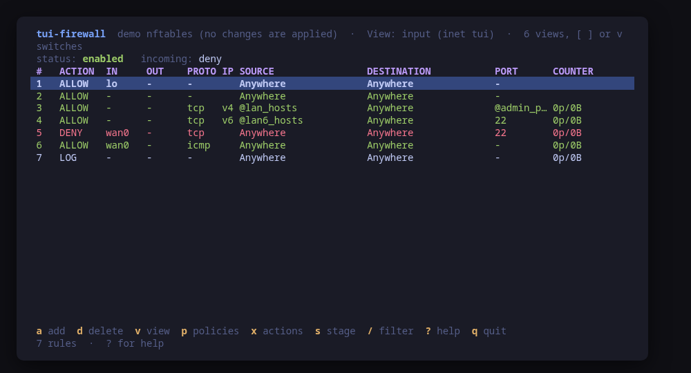
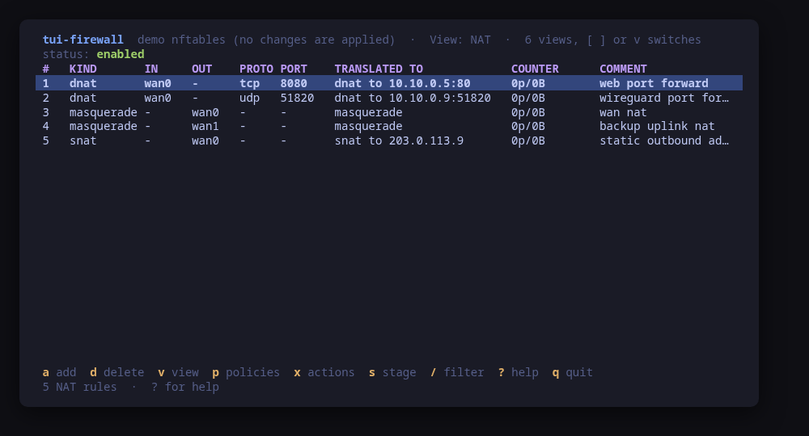
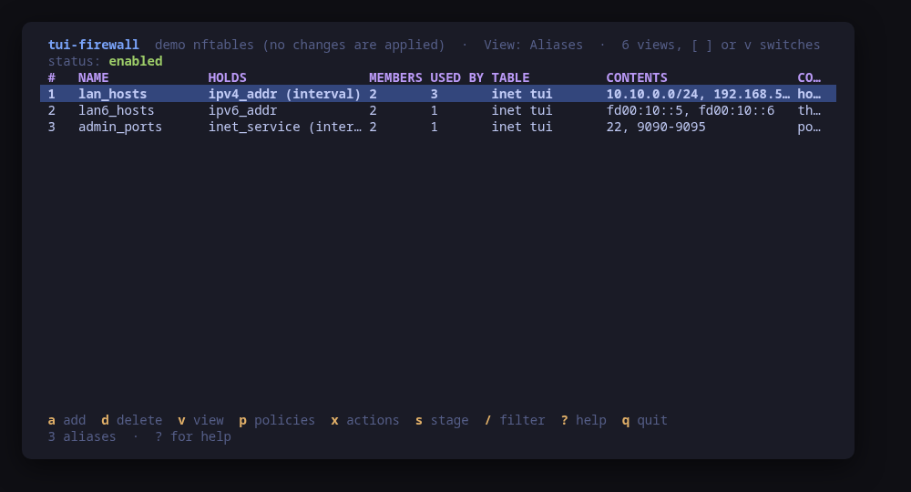
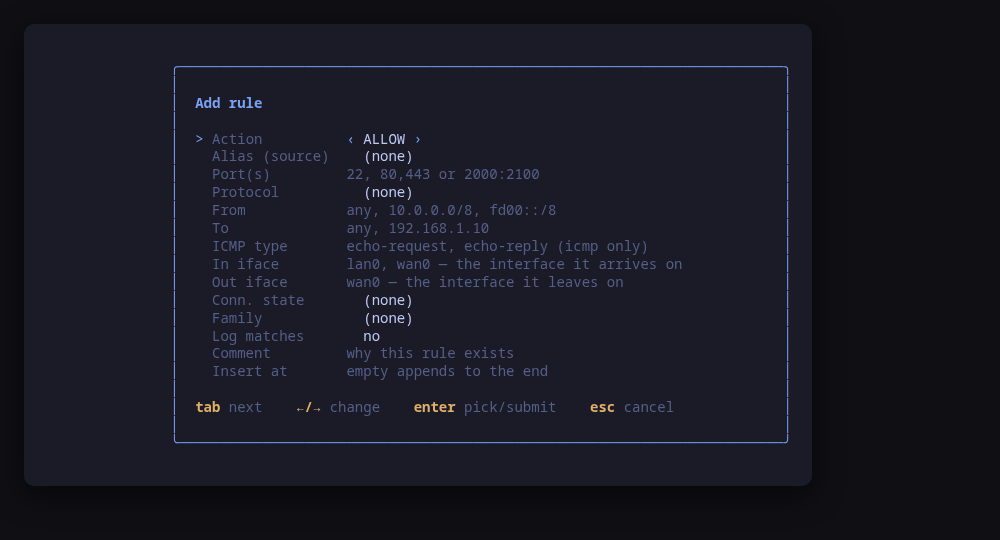
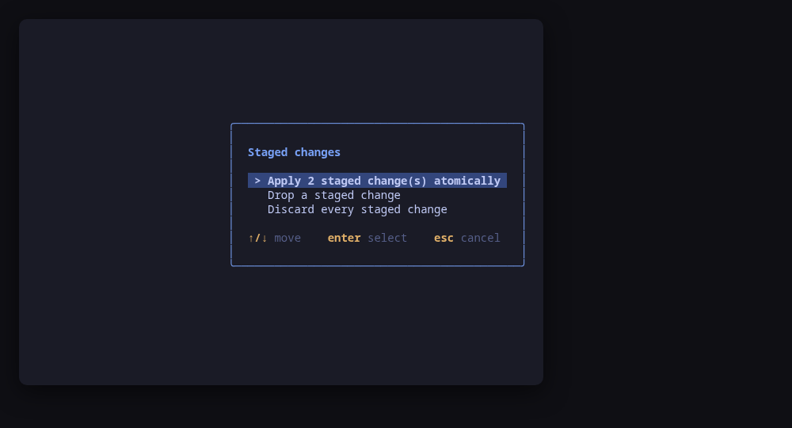
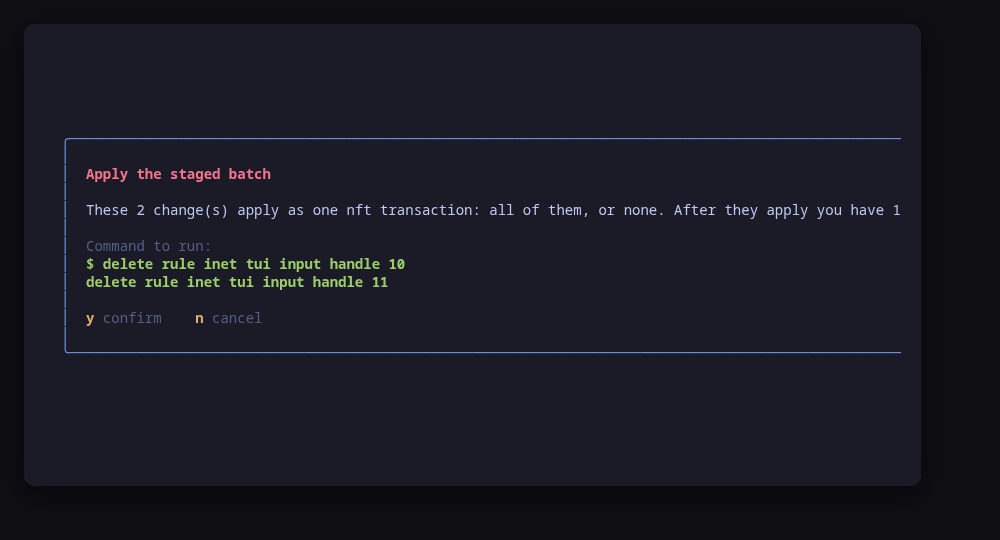

[](https://scorecard.dev/viewer/?uri=github.com/tui-tools/tui-firewall)
[](https://www.bestpractices.dev/projects/14368)

> **Beta.** The family is days old and still changing. Package names, flags
> and keys may move without notice until 1.0. Pin versions, and report what
> breaks.

A terminal UI for the Linux firewall — **ufw**, **firewalld** and **nftables** —
that shows the rules you actually have and **previews the exact command line of
every change before running it**.

None of them has a TUI: you get the CLI, or a desktop GUI. `tui-firewall`
fills the gap on a server or a tiling desktop, in the
[Omarchy](https://omarchy.org) visual style. It picks the backend your machine
actually runs, and the screen is built from what that backend can do — one rule
list and three default policies for ufw, one group per zone with its target for
firewalld, and for a machine neither of them manages, the raw nftables ruleset
read straight from `nft`: filter chains by hook, a NAT view, and named sets as
aliases.


> **Status: early, under validation.** An independent tool that follows the
> Omarchy visual style; it is **not** part of the Omarchy project and not
> endorsed by its maintainers. Expect rough edges.

## Install

<!-- install:start -->
<!-- Generated by tui-kit/tools/render-install.py from tool.json. -->
<!-- Edit the manifest, then run `make readme`. -->

### Arch Linux

Needs the tui-tools repository, which is a [one-time
setup](https://tui-tools.github.io/install/).

The one-liner detects the distribution and adds the repository and its signing
key:

```sh
curl -fsSL https://pkgs.tui.tools/install.sh | sh
```

Piping a script into a shell is not this family's style, so here is the same
setup by hand — read it, or read the script first with `curl -fsSL
https://pkgs.tui.tools/install.sh -o install.sh`:

```sh
curl -fsSL -o /tmp/tui-tools.asc https://pkgs.tui.tools/pubkey.asc
sudo pacman-key --add /tmp/tui-tools.asc
sudo pacman-key --lsign-key \
  "$(gpg --show-keys --with-colons /tmp/tui-tools.asc | awk -F: '/^fpr:/{print $10; exit}')"
printf '[tui-tools]\nServer = https://pkgs.tui.tools/arch/$arch\n' \
  | sudo tee -a /etc/pacman.conf
sudo pacman -Sy
```

Then, and for every other tool in the family:

```sh
sudo pacman -S tui-firewall
```

Upgrades then arrive with the rest of your system updates.

### Debian and Ubuntu

Needs the tui-tools repository, which is a [one-time
setup](https://tui-tools.github.io/install/).

The one-liner detects the distribution and adds the repository and its signing
key:

```sh
curl -fsSL https://pkgs.tui.tools/install.sh | sh
```

Piping a script into a shell is not this family's style, so here is the same
setup by hand — read it, or read the script first with `curl -fsSL
https://pkgs.tui.tools/install.sh -o install.sh`:

```sh
sudo install -d -m 0755 /etc/apt/keyrings
curl -fsSL https://pkgs.tui.tools/pubkey.asc \
  | sudo gpg --dearmor -o /etc/apt/keyrings/tui-tools.gpg
echo "deb [signed-by=/etc/apt/keyrings/tui-tools.gpg] https://pkgs.tui.tools/deb stable main" \
  | sudo tee /etc/apt/sources.list.d/tui-tools.list
sudo apt update
```

Then, and for every other tool in the family:

```sh
sudo apt install tui-firewall
```

Upgrades then arrive with the rest of your system updates.

### Fedora and RHEL

Needs the tui-tools repository, which is a [one-time
setup](https://tui-tools.github.io/install/).

The one-liner detects the distribution and adds the repository and its signing
key:

```sh
curl -fsSL https://pkgs.tui.tools/install.sh | sh
```

Piping a script into a shell is not this family's style, so here is the same
setup by hand — read it, or read the script first with `curl -fsSL
https://pkgs.tui.tools/install.sh -o install.sh`:

```sh
sudo rpm --import https://pkgs.tui.tools/pubkey.asc
sudo curl -fsSL -o /etc/yum.repos.d/tui-tools.repo https://pkgs.tui.tools/rpm/tui-tools.repo
sudo dnf makecache
```

Then, and for every other tool in the family:

```sh
sudo dnf install tui-firewall
```

Upgrades then arrive with the rest of your system updates.

### Any distribution, static binary

```sh
curl -fsSL https://github.com/tui-tools/tui-firewall/releases/download/v0.2.2/tui-firewall_0.2.2_linux_amd64.tar.gz | tar -xz tui-firewall
sudo install -m0755 tui-firewall /usr/local/bin/tui-firewall
```

One static binary. Verify it against checksums.txt from the same release.

### From source

```sh
git clone https://github.com/tui-tools/tui-firewall
cd tui-firewall && make build
sudo install -m0755 bin/tui-firewall /usr/local/bin/tui-firewall
```

Needs Go 1.26 or newer.

Not packaged for these yet; the static binary works everywhere in the meantime.

### Arch Linux (AUR) — coming soon

```sh
paru -S tui-firewall-bin
```

The -bin package installs the released static binary.

### openSUSE — coming soon

Needs the tui-tools repository, which is a [one-time
setup](https://tui-tools.github.io/install/).

```sh
sudo zypper install tui-firewall
```

The rpm repository is shared with dnf; zypper support is not tested yet.

### Verify a download

Every release of `tui-firewall` ships a `checksums.txt`. Check an archive
against it before installing:

```sh
sha256sum -c checksums.txt --ignore-missing
```
<!-- install:end -->

One static binary, no daemon, no state of its own. Nothing keeps running after
you quit.

## Try it without root

```sh
tui-firewall --demo             # an in-memory ufw
tui-firewall --demo=firewalld   # an in-memory firewalld
tui-firewall --demo=nftables    # a sample router ruleset
```

`--demo` runs against an in-memory sample firewall. Every key works, every
command is built and previewed for real, and nothing touches your system. The
three demos are the three real backends over fake output, not three skins: each
one parses backend-shaped output with the same parser and builds its commands
with the same builder. The nftables demo starts from a router ruleset — filter
chains for input, forward and output, the two NAT chains, and the named sets the
rules use as aliases.

## Every change is previewed


`y` runs the command shown, `n` does not. There is no other path to a change:
the UI hands the same value to the preview and to the runner, so what you read
is what executes.

## Usage

```sh
tui-firewall                      # drive the real firewall
tui-firewall --demo               # sample ufw data, no privileges needed
tui-firewall --demo=firewalld     # sample firewalld data
tui-firewall --demo=nftables      # sample router ruleset
tui-firewall --check              # read the firewall, print JSON, exit
tui-firewall --report             # print what a bug report needs, exit
tui-firewall --backend ufw        # skip autodetection
tui-firewall --backend firewalld
tui-firewall --backend nftables
tui-firewall --theme ~/mytheme/colors.toml
tui-firewall --sudo ""            # run the firewall command directly (as root)
tui-firewall --version
```

### `--check`, for scripts and tests

`--check` is the non-interactive read path: it loads the firewall through the
same backend the UI would use, prints the parsed model as JSON and exits 0, or
exits 1 with the reason if the backend cannot be read. No UI, and it never
builds or runs a mutation, so it is safe to run anywhere.

```console
$ sudo -n tui-firewall --check | head -8
{
  "tool": "tui-firewall",
  "version": "0.1.0",
  "backend": "ufw",
  "describe": "ufw via /usr/bin/sudo -n",
  "enabled": true,
  "logging": "low",
  "groups": 1,
```

It exists so a test can assert on what the tool *parsed* rather than on what it
painted — for instance that the rule count matches `ufw status numbered`, or
that a port added to the runtime configuration alone is reported as
`"Note": "runtime only"`, which is what catches a parser regression.

The report also carries a `backends` block naming every backend this tool
knows and what the detector saw of it, so "firewalld was chosen" is
distinguishable from "ufw is not installed" without running the detection
again. The version is probed for the selected backend only: probing the other
would run a binary nobody asked this tool to touch.

[tui-lab](https://github.com/tui-tools/tui-lab) uses it to test this tool
against real firewalls on Ubuntu, Fedora and Omarchy Server; the assertions live
in [`test/smoke.sh`](test/smoke.sh).

### `--report`, for bug reports

`--report` prints, in one block, everything a maintainer has to ask for
otherwise: the tool and kit versions, the backend and the version probed off
it, what the detector saw of the backend it did not choose, the distribution,
the kernel, the terminal, the theme, the escalation prefix, and whether the
running binary came from a package. It needs no privileges and reads no
firewall, so it works on the machine where the bug is — including one where no
backend can be selected at all, which is itself a thing worth reporting.

```console
$ tui-firewall --report
tui-firewall 0.2.2 (kit v0.2.9)
backend: firewalld 2.3.2
mode: live
distro: fedora 42 (Fedora Linux 42 (Workstation Edition))
kernel: 6.19.14-108.fc42.x86_64
arch: x86_64
locale: en_US.UTF-8
term: xterm-256color
theme: tokyo-night
sudo: sudo -n
root: no
binary: /usr/bin/tui-firewall (packaged)
backends: ufw absent, firewalld active
```

The block is written to be published as it is: it carries no hostname, user
name, home path or address, and no environment variable beyond `LANG`,
`LC_ALL`, `TERM` and `TERM_PROGRAM`. A binary living under your home directory
is reported as being there without naming the path. `--report` works with
`--demo` too, where it says so on the `mode` line.

The bug form asks for this block first — see
[`.github/ISSUE_TEMPLATE/bug_report.yml`](.github/ISSUE_TEMPLATE/bug_report.yml).

`tui-firewall` needs root to change anything, and to read anything on ufw. When
it is not running as root it uses `sudo -n`, which never prompts: run `sudo -v`
in another terminal first, or start `tui-firewall` with sudo. If neither
firewall nor `sudo` is available, it says so and points at `--demo`.

## Keys

| Key | Action |
| --- | --- |
| `↑`/`k`, `↓`/`j` | Move the selection |
| `g` / `G` | First / last rule |
| `pgup` / `pgdn` | Scroll a page |
| `/` | Filter rules (matches any column; `esc` clears) |
| `a` | Add a rule |
| `d` | Delete the selected rule |
| `e` | Enable or disable the firewall (ufw only) |
| `r` | Reload the firewall |
| `p` | Change a default policy (ufw) or a zone target (firewalld) |
| `L` | Change the logging level (ufw) or the log-denied value (firewalld) |
| `x` | Actions this backend offers beyond these keys |
| `[` / `]` | Previous / next group — the firewalld zones and policy objects |
| `R` | Re-read the firewall |
| `?` | Help |
| `q` | Quit |

In the **add rule** form: `tab` / `shift+tab` move between fields, `←`/`→`
cycle a choice, `enter` opens a picker on a choice field and submits from a
text field, `esc` cancels.


## firewalld


A firewalld zone holds several species of entry at once, so each row carries
its **kind** — service, port, protocol, source port, forward port, bound
source, assigned interface, masquerading, intra-zone forwarding, ICMP block,
rich rule. The kind is what decides which flag removes it, which is why it is
shown rather than flattened away.

### Runtime and permanent, side by side

firewalld keeps two configurations: the one enforced right now and the one that
survives a reload or a reboot. They routinely differ — an interface
NetworkManager assigned, a port someone added without `--permanent`, a change
made permanently and not yet reloaded. `tui-firewall` reads both
(`--list-all-zones` and the same with `--permanent`) and marks the difference in
a **WHERE** column: nothing when an entry is in both, `runtime only` or
`permanent only` when it is not.

That also decides what a delete does. Removing an entry that exists in both
issues both commands; removing one that exists in the runtime only issues the
runtime command alone, because the permanent form would simply fail.

### How a change is applied

Every change runs **twice**: the command as it is, then the same command with
`--permanent`. Both lines are in the confirm dialog, and nothing else runs.

```console
firewall-cmd --zone=public --add-service=wireguard
firewall-cmd --permanent --zone=public --add-service=wireguard
```

The alternative — `--permanent` followed by `--reload` — was rejected on
purpose: a reload rebuilds the rule set and can drop established connections,
which is a bad thing to do to someone who just wanted to open a port over SSH.

There is exactly one change firewalld has no runtime form for, the **zone
target**: `--set-target` is permanent-only, so that change is written
permanently and applied with a reload. The dialog says so before you confirm.

### Actions beyond the shared keys


`x` opens the actions a backend offers that the common key map has no place
for. For firewalld those are: set the default zone, move an interface to
another zone, bind a source address to this zone, turn masquerading on or off,
turn **panic mode** on or off, and save the running configuration as permanent
(`--runtime-to-permanent`). Each one previews its commands like any other
change, and panic mode says in as many words that it drops the SSH session you
are reading it in.

The UI does not know what any of these mean: the backend describes them, the UI
collects the answers and previews whatever comes back. That is the same reason
`e` is absent on firewalld — starting and stopping a system service is
`systemctl`'s job, and the tool says so instead of doing it quietly.

## nftables



On a machine that runs neither ufw nor firewalld, `tui-firewall` reads `nft -j
list ruleset` and drives `nft` itself. It is the third backend, picked
automatically when the other two are absent, and the screen is built from the
ruleset it finds rather than from a fixed layout.

Because nftables is not a policy manager but the packet path itself, the rule
list reads the way a router's rule list reads: the verdict, the **interfaces**
the packet passes between (`iifname` / `oifname`), the **connection state** it
matches (`ct state established,related`), the protocol and port, and the
**counter** that says whether the rule has ever fired. A chain has a view of its
own, one group per hooked chain, stepped through with `[` and `]` or picked from
`v`; base chains show their **policy** even when they hold no rules, because the
policy is a fact worth seeing.

Two chain types get a view shaped for the question they answer:

- **NAT.** Address translation is read as *what does this become*, not *what is
  allowed*, so the masquerade, SNAT and DNAT rules of the `nat` chains are shown
  in their own view with the translated target as the column the eye lands on.

  

- **Aliases.** A named set is an alias a rule refers to by name. Each is listed
  with what it holds, its members, and how many rules use it — a set nothing
  refers to is dimmed as dead weight, and one four rules refer to is four rules
  you change by editing it.

  

The add-rule form carries the matches a router rule needs that ufw and firewalld
never expose: inbound and outbound interface, connection state, ICMP type,
address family, and an alias as the source.



### What it writes, and where it will not

nftables has no permanent/runtime split and no manager to answer to, so a write
is a change to the live ruleset. That makes it easy to lock yourself out, and
`tui-firewall` is deliberately narrow about where it writes: only to a **base
chain whose policy nft reported**, or to **its own table**. A chain that some
other manager owns is shown but marked read-only, and the tool says why in the
chain's own description rather than letting you find out at the confirm dialog.
Every rule is deleted by its **handle**, which `nft -j` carries in the ruleset,
because a rule's position shifts the moment anything is inserted above it.

### Staged atomic apply, with a connectivity-safe rollback

Changing many rules on a router one command at a time is how a remote session
dies halfway through, with the box in a state that is neither the old ruleset nor
the new one. nftables can do better, and this backend uses it: press `s` to turn
**staging** on, and every change is collected instead of applied. `S` reviews
the pending set.



Applying the batch is one `nft -f` transaction: **all of the changes, or none**,
never a half-applied ruleset. Before it runs, the whole transaction is previewed
— the script that goes to `nft`'s standard input, which no single command line
could show.



The apply is also **connectivity-safe**. Just before the batch runs, the tool
snapshots the current ruleset; then it applies, and starts a timer. If you press
`k` to say you still have access, the batch stays. If you do not — because the
change you just made cut off the session you are reading this in — the snapshot
is restored automatically when the timer expires, and you are back on the ruleset
that was working. It is the standard `iptables-apply` idea, done as one nft
transaction.

## What v0.1 can do

**Every backend**

- Read the live firewall and show status, default policies and logging.
- List rules with action, source, destination, ports, protocol, service,
  address family and comment; filter across every column.
- Add and delete rules, reload, change a default policy, change the logging
  level — each previewed and confirmed first.
- Follow the active Omarchy theme, and respect `NO_COLOR`.

**ufw**

- Read `ufw status verbose`, `ufw status numbered` and `ufw app list`.
- Default policies for incoming, outgoing and routed traffic; `route` rules and
  IPv6 rules included.
- Add a rule with an action (allow/deny/reject/limit), a direction, a port,
  port list or range, a protocol, an app profile, source and destination CIDR,
  a comment, and insertion at a given position.
- Enable and disable the firewall.

**firewalld**

- Read `--state`, `--get-default-zone`, `--get-active-zones`,
  `--list-all-zones` (runtime and permanent), `--get-services`,
  `--get-log-denied`, `--query-panic`, `--query-lockdown` and the policy
  objects from `--get-policies`.
- One group per zone, default zone first, then the other active zones; policy
  objects follow as further groups.
- Every entry kind, each marked runtime-only or permanent-only where they
  differ, and each deletable with the right flag.
- Add a service or a port; anything with an address, an address family, a
  logging flag or a reject/drop verdict is built as a **rich rule** instead,
  from the same guided form.
- Zone target, log-denied value, reload, and the actions menu above.

**nftables**

- Read `nft -j list ruleset` and show every base and used regular chain, its
  hook and its policy, as one group each.
- The router reading of a rule: inbound and outbound interface, connection
  state, protocol, port, address family, counter and comment.
- A NAT view for masquerade, SNAT and DNAT port forwards, and an aliases view of
  the named sets with the number of rules using each.
- Add a rule with an action (accept/drop/reject), an interface pair, a
  connection-state match, an ICMP type, an alias as the source, and a family;
  add a masquerade, a port forward or a named set from the actions menu.
- Write only to a base chain nft reported a policy for, or to the tool's own
  table, and say why when it will not. Delete by handle.
- Stage changes and apply them as one atomic `nft -f` transaction, with an
  automatic connectivity-safe rollback if the apply is not kept in time.

## What v0.1 cannot do

- **No rule editing.** Change a rule by deleting it and adding the new one.
- **No `ufw` interface qualifiers** (`ufw allow in on eth0 …`): they are parsed
  and displayed, but the form cannot create them.
- **No `ufw` application profile management** (only using existing profiles).
- **No firewalld service, ipset or icmptype editing**, and no zone creation:
  zones and services are used, not defined.
- **A firewalld policy object is read-only-ish**: its entries are listed and can
  be added and removed, but its target and its ingress/egress zones are not
  editable here.
- **No live log tail.**
- **No nftables rule editing or reordering**, and no set-element editing: a rule
  is changed by deleting it and adding the new one, and a named set is created or
  used, not edited member by member.
- Rules follow the backend's own order; there is no reordering key.

## Compatibility

<!-- compat:start -->
<!-- Generated by tui-kit/tools/render-compat.py from tool.json. -->
<!-- Edit the manifest, then run `make readme`. -->

`tui-firewall` probes its backend once at startup and shows the version in the
header. A version nobody has tested is marked `(untested)` there rather than
hidden; one below the minimum is marked as such and the tool still runs.

### ufw

| | |
| --- | --- |
| Binary | `ufw` |
| Version read with | `ufw --version` |
| Minimum | 0.36 |
| Tested | `0.36.2` |
| Version-gated features | `rule-comments` (since 0.35) |

| Versions | What changes |
| --- | --- |
| `<0.36` | `ufw status numbered` has no app profile column, so a rule added from a profile is shown by its ports and cannot be edited as a profile |
| `0.36.x` | `status numbered` indexes IPv4 and IPv6 halves of one rule separately, so deleting by number renumbers the rest and the list is re-read after every delete |

### firewalld

| | |
| --- | --- |
| Binary | `firewall-cmd` |
| Version read with | `firewall-cmd --version` |
| Minimum | 0.9 |
| Tested | `2.4.4` |

| Versions | What changes |
| --- | --- |
| `==2.0.0` | `--permanent --list-all-zones` prints the same settings for every zone on this release (firewalld#1152), so the permanent half of the runtime/permanent comparison is not trustworthy; 2.0.1 fixed it |
| `>=2.2` | firewalld removed the lockdown feature, so no lockdown state is shown |

### nftables

| | |
| --- | --- |
| Binary | `nft` |
| Version read with | `nft --version` |
| Minimum | 0.9 |
| Tested | none yet |

| Versions | What changes |
| --- | --- |
| `<0.9` | `nft -j` does not exist yet, so there is no ruleset to read in any form this tool will parse. 0.9.0 is where nft grew JSON output and stamped it json_schema_version 1, the schema this backend reads, and that is the whole reason the minimum is 0.9 |
| `>=0.9` | `nft -j list ruleset` carries rule handles whether or not `-a` is given, unlike the human output. A handle is how a rule is deleted, because positions shift the moment anything is inserted above them |

The tested versions are generated from `compat/results.jsonl`, which the tool's
own smoke test appends to when it runs against a real machine in
[tui-lab](https://github.com/tui-tools/tui-lab).
<!-- compat:end -->

The nftables backend shows no tested version yet because no smoke run has
appended one to `compat/results.jsonl`. It has been exercised end to end in the
[tui-lab](https://github.com/tui-tools/tui-lab) `router-topology` scenario — a
libvirt router on Ubuntu noble, where the read path, the router matches, the NAT
and alias views and the staged atomic apply were driven against a real `nft`,
alongside the network-namespace tests in this repo. A tested version will land
here once that run records one through the smoke test.

## Configuration

`/etc/tui-firewall/config.toml`, then `~/.config/tui-firewall/config.toml` (the
user file overrides the machine-wide one), then `TUI_FIREWALL_*` in the
environment. Flags override everything. See
[`examples/config.toml`](examples/config.toml).

```toml
# Which firewall to drive: "auto", "ufw" or "firewalld".
backend = "auto"

# Privilege escalation prefix; "" runs the command directly.
sudo = "sudo -n"

# Path to an Omarchy-style colors.toml; empty follows the active theme.
theme = ""
```

With `backend = "auto"`, `tui-firewall` takes the installed backend whose system
service is running. If neither is running it takes the one systemd would start
at boot (`systemctl is-enabled`), and if neither is enabled either, the first
one installed — ufw before firewalld. Having both on one machine is a
misconfiguration rather than a supported setup, so the tie-break exists to be
predictable; name the one you mean when both are present. With nothing
installed it exits with a message naming what to install.

## Theme

The default palette is **Tokyo Night**. On Omarchy, the tool reads the active
desktop theme from `~/.config/omarchy/current/theme/colors.toml` and follows it.
`TUI_THEME` or `--theme` override; `NO_COLOR` drops color and keeps layout. The
rules live in [tui-kit](https://github.com/tui-tools/tui-kit#theme-rules).

## Architecture

The UI never builds a `ufw` command line. It talks to
`internal/firewall.Backend`, which returns a backend-neutral model:

```
Model{Enabled, Logging, Groups []Group}
Group{Name, Default policies, PolicySlots, Rules []Rule}
Rule{Action, Direction, Proto, Ports, From, To, Service, Comment, Family, Raw, Extra}
```

ufw exposes a single group (`rules`) carrying the global in/out/routed
policies; the group selector stays hidden when there is only one. firewalld
exposes one group per zone with the zone target as its policy, plus one per
policy object — the full mapping is documented at the top of
`internal/firewalld/firewalld.go`. nftables exposes one group per hooked or used
chain with its policy, plus a NAT view and an aliases view; the `Extra` map is
where the router-shaped fields ride — interface, connection state, counter,
translated target, set membership — so the same `Rule` serves every backend
without the model growing a column per feature.

Mutations are `firewall.Change` values produced by the backend: an ordered list
of `runner.Command`s with the description and the danger flag the dialog is
painted from. The list exists because firewalld needs two invocations to apply
one change, and making that a list rather than a hidden second exec keeps the
promise intact — every line the dialog shows is a line that runs, and nothing
else does. On nftables a staged batch is the same idea taken to its limit: the
whole set of changes is one `nft -f` transaction, previewed as the script it
sends, applied all-or-nothing, and rolled back to a pre-apply snapshot if the
operator does not confirm they still have access in time. On confirmation the UI hands those commands back to the
[kit runner](https://github.com/tui-tools/tui-kit#the-contract-preview-confirm-run),
which resolves the binary and the privilege prefix. That is the whole trust
boundary.

Everything else the UI shows is likewise the backend's answer, not a branch on
its name: which actions the add form offers, whether `e` exists at all, whether
rows carry a kind, what the logging concept is called, and what the `x` menu
holds. `grep firewalld cmd/` finds a test and nothing more.

## Development

```sh
make check        # gofmt, go vet and the tests: what CI runs
make test
make build
make demo
make screenshots  # re-render the frames above from --demo
```

Dependencies are deliberately small: Bubble Tea, Bubbles and
[tui-kit](https://github.com/tui-tools/tui-kit), which carries the palette, the
widgets, the config loader and the command runner shared by the whole family.

## Prior art

[The-Robin-Hood/ufWall](https://github.com/The-Robin-Hood/ufWall) is an earlier
Go + Bubble Tea TUI for ufw (MIT, early-stage, inactive since March 2026);
`tui-firewall` is an independent implementation with its own parsers and a
backend-agnostic core that covers firewalld as well.

## Safety notes

- Enabling the firewall over SSH can lock you out. `tui-firewall` warns before
  confirming, but **add a rule for your SSH port first**.
- `ufw enable` and `ufw delete` are run with `--force`, because ufw's own
  interactive prompt cannot be answered from inside a TUI. The confirm dialog
  replaces it.
- **firewalld panic mode drops every packet**, including your own session, and
  is offered behind an explicit warning. It is not permanent: restarting
  firewalld clears it.
- A firewalld **reload** replaces the running configuration with the permanent
  one, so anything that was runtime-only is lost. That is why ordinary changes
  here do not reload.
- `tui-firewall` re-reads the firewall after every change, so what you see is
  what the system reports, not what the tool assumed.

## Contributing

Contributions are welcome as pull requests; the workflow, the commit style and
the checks a change has to pass are described in the family's
[CONTRIBUTING.md](https://github.com/tui-tools/tui-kit/blob/main/CONTRIBUTING.md).
Security vulnerabilities go through the family's
[SECURITY.md](https://github.com/tui-tools/tui-kit/blob/main/SECURITY.md)
instead, never in a public issue.

## License

MIT — see [LICENSE](LICENSE). Part of the
[tui-tools](https://github.com/tui-tools) family.
