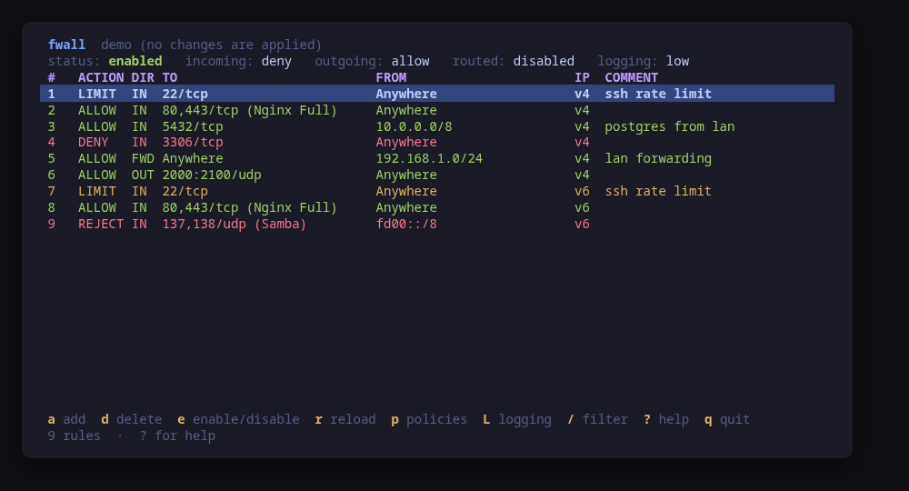

# tui-tools

A family of terminal tools for Linux, in the visual style of
[Omarchy](https://omarchy.org): the same palette, the same key language and the
same "show me before you do it" behaviour as lazygit, lazydocker and btop.

Every tool is a **single static binary**, works on Debian/Ubuntu and Arch, and
runs **no daemon**. Nothing is installed in the background, nothing keeps
running after you quit.



## Tools

| Tool | What it does | Status |
| --- | --- | --- |
| [`fwall`](cmd/fwall/README.md) | Manage the system firewall (ufw today, firewalld planned) | v0.1 |

## Install

Grab a binary from the releases page, or build it yourself:

```sh
git clone https://github.com/edimarlnx/tui-tools
cd tui-tools
make build          # binaries land in ./bin
sudo install -m0755 bin/fwall /usr/local/bin/fwall
```

Try any tool without touching your system:

```sh
make demo           # fwall against an in-memory sample firewall
```

## Design rules

These hold for every tool in the repo.

- **Preview, then confirm.** No tool ever changes the system without first
  showing the exact command line it is about to run. The confirm dialog is the
  only path to a mutation.
- **Read-only by default.** Starting a tool only reads state.
- **No daemon, no state of its own.** The system is the source of truth; the
  tools re-read it after every change.
- **Backend-agnostic core.** The UI talks to an interface, never to a specific
  CLI. That is what lets `fwall` grow a firewalld backend without touching the
  screens.
- **Responsive.** Layouts adapt from a 40-column pane to a full screen.

## Theme

Every tool draws from `pkg/theme`, so they all look alike.

The default palette is **Tokyo Night**. If you run Omarchy, the tools read the
active desktop theme from `~/.config/omarchy/current/theme/colors.toml` and
follow it, so switching your desktop theme switches the tools too. Any
Omarchy-format `colors.toml` works.

Precedence:

1. `TUI_THEME=/path/to/colors.toml` (or a tool's `--theme` flag);
2. the active Omarchy theme, when that file exists;
3. the built-in Tokyo Night palette.

`NO_COLOR=1` is respected: layout, borders and emphasis stay, colors go away.

## Repository layout

```
cmd/<tool>/       one directory per binary
internal/         backends and domain logic, not importable from outside
pkg/theme/        shared palette and Lip Gloss styles
pkg/ui/           shared widgets: header, table, help bar, dialogs, status line
examples/         sample configuration files
```

`pkg/` is the shared surface: a new tool imports `pkg/theme` and `pkg/ui` and
inherits the whole look and key language for free.

## Development

```sh
make check        # gofmt, go vet and the tests: what CI runs
make test
make build
make demo
```

Dependencies are kept deliberately small: Bubble Tea, Bubbles and Lip Gloss,
nothing else. Configuration and theme files are parsed with a small purpose-made
reader rather than a TOML library.

## Releases

Each tool is released on its own tag, prefixed with the tool name:

```sh
git tag fwall/v0.1.0
git push origin fwall/v0.1.0
```

GoReleaser builds static `linux/amd64` and `linux/arm64` binaries
(`CGO_ENABLED=0`) for that tool only.

## License

MIT — see [LICENSE](LICENSE).
